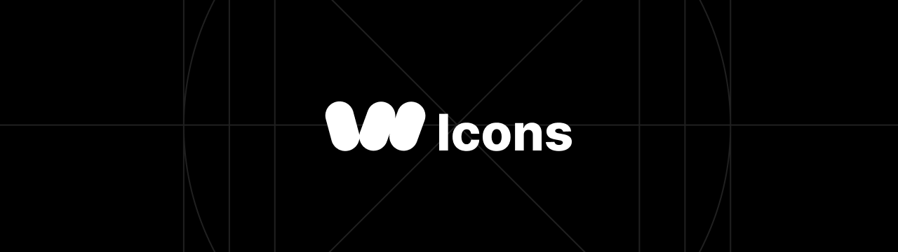

[](https://woozdesign.com/docs/icons)

24x24 icons crafted by the WoozDesign team.

Extended design of [Feather Icons](https://feathericons.com). Special thanks to [@Feather Icons](https://feathericons.com) Team!

---

## Documentation

All icons are available as React component.

Install WoozDesign Icons from npm:

```bash
npm install @woozdesign/icons
```

Import the icons into your React project:

```js
import '@woozdesign/icons'; // Import CSS
import { Icon } from '@woozdesign/icons';

function MyComponent() {
  return (
    <div>
      <Icon type="feather" />
    </div>
  );
}
```

## Authors

- Feather Icons ([@FeatherIcons](https://github.com/feathericons/feather))
- Leo Kim ([@LeoKim](https://github.com/william8012))
